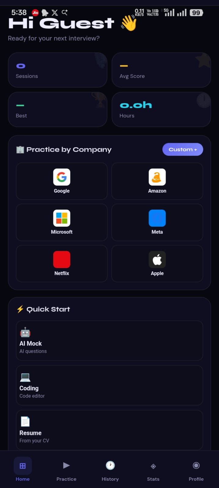
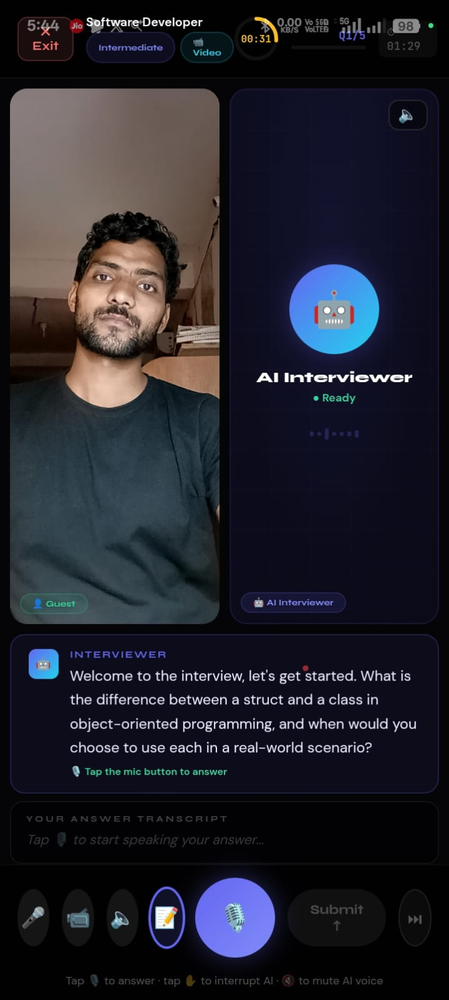
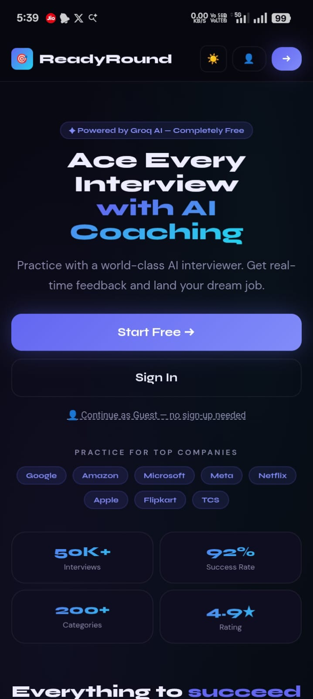

# 🚀 ReadyRound – AI Interview Preparation Platform

<h2>⚠️ **This repository is only a DEMO version.**</h2>

The complete production source code is kept in a **private repository** to protect intellectual property.

If you are a recruiter or collaborator and want to review the full code, please contact me or request access.

ReadyRound is an AI-powered interview preparation platform designed to help students and developers practice coding, technical, and behavioral interviews using artificial intelligence.

It simulates real interview scenarios and generates questions to help users improve problem-solving skills and interview confidence.

---

## 🌐 Live Demo
https://readyround.vercel.app/

---

## 📸 Screenshots

<b>Home Page</b>&nbsp;&nbsp;&nbsp;&nbsp;&nbsp;&nbsp;&nbsp;&nbsp;
<b>Dashboard</b>&nbsp;&nbsp;&nbsp;&nbsp;&nbsp;&nbsp;&nbsp;&nbsp;
<b>Interview Page</b>

  

---

## ✨ Features

- 🤖 AI-generated interview questions
- 💻 Coding interview practice
- 🧠 Technical & behavioral interview preparation
- ⚡ Real-time interview simulation
- 🎯 Multiple interview categories
- 📈 Improve problem-solving and interview confidence

---

## 🛠 Tech Stack

Frontend  
- HTML  
- CSS  
- JavaScript  
- React  

Backend  
- API Integration  
- AI Model Integration  

Tools  
- Git  
- GitHub  

Deployment  
- Vercel
---

## 🚀 Usage

1. Open the application  
2. Select interview category  
3. Choose difficulty level  
4. Practice AI-generated interview questions, or
5. Resume-based question generation
6. Improve your interview performance
7. Get the Interview feedback

---

<h4>## 👨‍💻 Author

<b>Avinash Yadav  
Founder & Developer of ReadyRound </b>  </h4>

GitHub  
https://github.com/avinash-as  

## Connect With Me

If you would like to review the full source code or discuss opportunities, please contact me.

🔗 LinkedIn: https://www.linkedin.com/in/avinashhhh  
💻 GitHub: https://github.com/avinash-as

The production source code is stored in a private repository and access can be provided upon request.

---

## ⭐ Support

If you like this project, please ⭐ the repository on GitHub.

